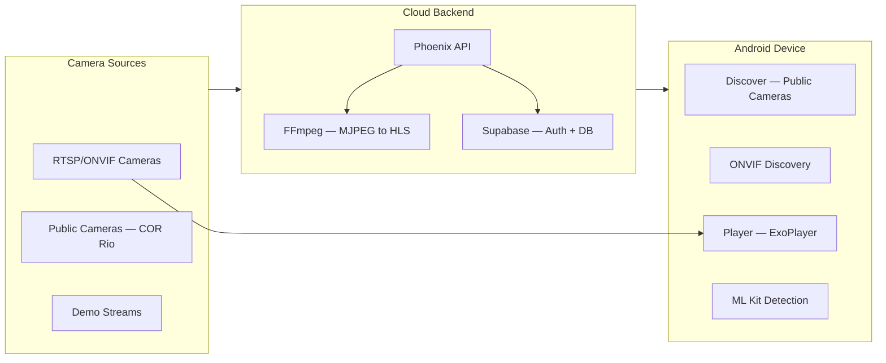
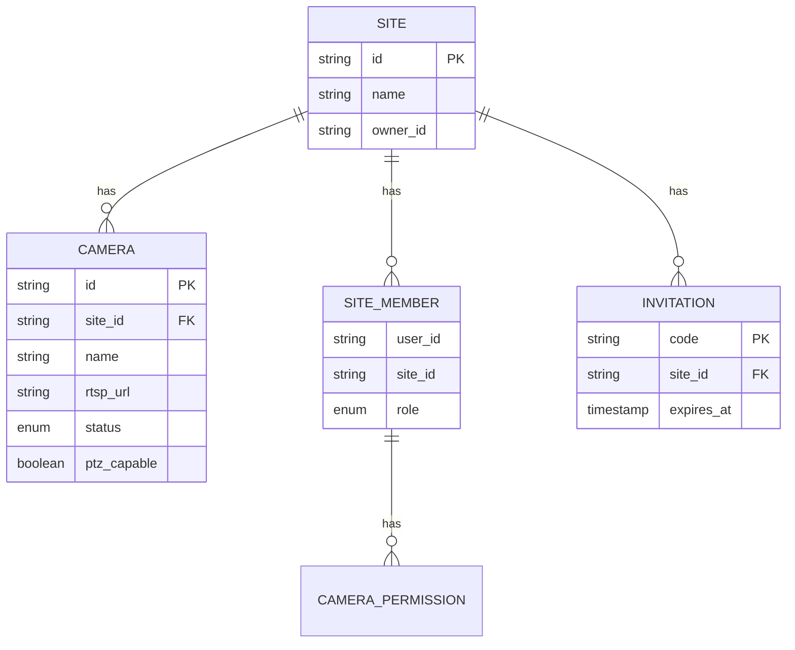

<div align="center">


<br/>

[](https://kotlinlang.org)
[](https://developer.android.com/jetpack/compose)
[](https://supabase.com)
[](https://phoenixframework.org)
[](https://firebase.google.com)
[](./LICENSE)

---

*"Monitoramento profissional de cameras de seguranca, do descobrimento ao streaming ao vivo."*

</div>

---

> [!NOTE]
> **VigiPro** is a multi-module Android app for professional security camera monitoring (CCTV/ONVIF).
> Features ONVIF auto-discovery, RTSP/HLS live streaming, PTZ control, ML Kit smart detection,
> public camera catalog, multi-site management, and a Phoenix Cloud backend with real-time
> MJPEG-to-HLS conversion.

---

## Overview



| Property | Value |
|:---------|:------|
| **Language** | Kotlin 2.1 (Coroutines, Serialization, KSP) |
| **UI** | Jetpack Compose + Material 3 |
| **State** | Orbit MVI (Container, Intent, Reduce) |
| **DI** | Dagger Hilt |
| **Backend** | Phoenix 1.8 (Elixir) + Supabase |
| **Auth** | Firebase Auth + Google Sign-In |
| **Video** | ExoPlayer (RTSP + HLS) |
| **Protocol** | ONVIF (discovery, PTZ, profiles) |
| **Detection** | ML Kit (objects, text, labels) |
| **Min SDK** | 26 (Android 8.0) |

---

<p align="center">
  <a href="#-features">Features</a>&nbsp;&nbsp;&nbsp;|&nbsp;&nbsp;&nbsp;
  <a href="#-architecture">Architecture</a>&nbsp;&nbsp;&nbsp;|&nbsp;&nbsp;&nbsp;
  <a href="#-player">Player</a>&nbsp;&nbsp;&nbsp;|&nbsp;&nbsp;&nbsp;
  <a href="#-cloud-backend">Cloud Backend</a>&nbsp;&nbsp;&nbsp;|&nbsp;&nbsp;&nbsp;
  <a href="#-quick-start">Quick Start</a>&nbsp;&nbsp;&nbsp;|&nbsp;&nbsp;&nbsp;
  <a href="#-domain-model">Domain Model</a>&nbsp;&nbsp;&nbsp;|&nbsp;&nbsp;&nbsp;
  <a href="#-license">License</a>
</p>

---

## ⚡ Features

| Feature | Description |
|:--------|:------------|
| **ONVIF Discovery** | Auto-discover cameras on local network via WS-Discovery |
| **RTSP Streaming** | Live video with ExoPlayer, TCP transport, low latency |
| **HLS Streaming** | Cloud-converted streams from public MJPEG cameras |
| **PTZ Control** | Pan/Tilt/Zoom via ONVIF with touch gestures |
| **Public Cameras** | Browse 14+ real public cameras (COR Rio, US DOT) without login |
| **ML Kit Detection** | On-device object detection, text recognition, image labeling |
| **Multi-Site** | Organize cameras by site with role-based access control |
| **Invite System** | QR code invitations with time-scoped camera permissions |
| **Offline-First** | Room DB cache, RTSP credentials never leave device |
| **Firebase** | Auth, Crashlytics, FCM, Analytics, Remote Config, App Check |

---

## 🏗 Architecture

```
app/                          → Entry point, navigation, FCM
core/
  core-model/                 → Domain models (pure Kotlin)
  core-network/               → Supabase client + Cloud API
  core-data/                  → Room DB, repositories, ML Kit engines
  core-ui/                    → Material 3 theme, shared components
feature/
  feature-auth/               → Firebase Auth + Google Sign-In
  feature-discover/           → Public camera catalog (no login required)
  feature-dashboard/          → Camera grid with multi-site support
  feature-player/             → RTSP/HLS player + PTZ + fullscreen
  feature-devices/            → ONVIF discovery + QR scanning
  feature-sites/              → Site management
  feature-access-control/     → Invitations + role management
  feature-settings/           → App settings + account
build-logic/convention/       → Gradle convention plugins
cloud/                        → Phoenix API backend (Elixir)
supabase/migrations/          → SQL migrations
```

### Convention Plugins

| Plugin | What it does |
|:-------|:-------------|
| `vigipro.android.application` | App module setup (compileSdk, signing, etc.) |
| `vigipro.android.library` | Library module defaults |
| `vigipro.android.compose` | Compose BOM + dependencies |
| `vigipro.android.hilt` | KSP + Hilt wiring |
| `vigipro.android.feature` | All-in-one: library + compose + hilt + Orbit MVI + navigation |

> Feature modules only need `plugins { alias(libs.plugins.vigipro.android.feature) }` — the convention plugin handles everything.

---

## 🎬 Player

The player supports multiple stream types:

| Source | Protocol | Handling |
|:-------|:---------|:---------|
| Local cameras | RTSP over TCP | Direct ExoPlayer `RtspMediaSource` |
| Public cameras (COR Rio) | MJPEG → HLS | Phoenix backend converts via FFmpeg |
| Public cameras (US DOT) | HLS | Direct ExoPlayer `HlsMediaSource` |
| Demo cameras | HLS | FFmpeg lavfi test patterns |

<details>
<summary><strong>PTZ Control</strong></summary>

- Touch-based directional control overlay
- ONVIF ContinuousMove / AbsoluteMove
- Zoom via pinch gesture
- Preset positions support

</details>

<details>
<summary><strong>Smart Detection (ML Kit)</strong></summary>

| Engine | Model | Detects |
|:-------|:------|:--------|
| Object Detection | EfficientDet-Lite0 | Person, vehicle, animal |
| Text Recognition | ML Kit Latin | License plates, signs |
| Image Labeling | ML Kit default | Scene classification |

Auto-alerts on person detection via `SmartDetectionManager`.

</details>

---

## ☁ Cloud Backend

**Phoenix 1.8** (Elixir) — API-only, deployed via Docker on VPS.

| Endpoint | Description |
|:---------|:------------|
| `GET /api/health` | Health check |
| `GET /api/public/cameras` | Public camera catalog (paginated) |
| `GET /api/public/categories` | Camera categories with counts |
| `GET /hls/:camera_id/:file` | HLS segments (CORS enabled) |
| `POST /api/cameras/sync` | Sync cameras (JWT auth) |
| `POST /api/events` | Log camera events (JWT auth) |

### Stream Pipeline

```
COR Rio MJPEG → FFmpeg (mjpeg → x264 → HLS) → /tmp/vigipro_hls/ → Nginx → Client
                  ↑ reconnect flags              ↑ HlsCleaner        ↑ SSL
                  ↑ ultrafast preset              ↑ skips active      ↑ Certbot
```

<details>
<summary><strong>Deployment</strong></summary>

```bash
cd cloud
bash deploy.sh    # rsync + docker build + nginx + certbot
```

Runs at `https://vigipro.mahina.cloud` — Docker + Nginx reverse proxy + Let's Encrypt SSL.

</details>

---

## 🚀 Quick Start

### Prerequisites

| Tool | Version | Required |
|:-----|:--------|:---------|
| Android Studio | Ladybug+ | Yes |
| JDK | 21 | Yes |
| Kotlin | 2.1.10 | Yes |
| Gradle | 8.12.1 | Yes |
| Supabase CLI | latest | For DB migrations |

### Build

```bash
git clone https://github.com/gabrielmaialva33/vigipro.git
cd vigipro

# Debug build
./gradlew assembleDebug

# Release build
./gradlew assembleRelease

# Run tests
./gradlew test
```

<details>
<summary><strong>Environment Setup</strong></summary>

Create `local.properties` or set in `BuildConfig`:

```properties
SUPABASE_URL=https://your-project.supabase.co
SUPABASE_KEY=your-anon-key
```

Firebase: place `google-services.json` in `app/`.

</details>

---

## 🗄 Domain Model



### Roles

| Role | Permissions |
|:-----|:------------|
| **OWNER** | Full control, manage members, delete site |
| **ADMIN** | Add/remove cameras, invite members |
| **VIEWER** | View cameras, receive alerts |
| **TIME_RESTRICTED** | View cameras within time windows |
| **GUEST** | View specific cameras only |

---

## 🔒 Security

- **RLS** — All Supabase tables enforce Row Level Security based on `auth.uid()`
- **SECURITY DEFINER** — `redeem_invitation` runs with elevated permissions
- **RTSP credentials** — Stored locally only (Room DB), never synced to cloud
- **App Check** — Play Integrity provider validates device authenticity
- **Token refresh** — Supabase SDK handles automatic session renewal

---

## 📦 Tech Stack

| Layer | Technology |
|:------|:-----------|
| **UI** | Jetpack Compose, Material 3, Phosphor Icons |
| **State** | Orbit MVI (orbit-core, orbit-compose, orbit-viewmodel) |
| **DI** | Dagger Hilt |
| **Navigation** | Jetpack Navigation Compose |
| **Networking** | Supabase SDK 3.1.2 (Ktor), OkHttp, Retrofit |
| **Persistence** | Room v2, DataStore Preferences |
| **Video** | Media3 ExoPlayer (RTSP + HLS) |
| **Camera Protocol** | ONVIF (com.seanproctor:onvifcamera) |
| **ML** | ML Kit (Object Detection, Text Recognition, Image Labeling) |
| **QR** | ZXing (generation), ML Kit Barcode (reading) |
| **Images** | Coil 3 (Ktor backend) |
| **Auth** | Firebase Auth, Google Credential Manager |
| **Monitoring** | Firebase Crashlytics, Analytics, Performance |
| **Push** | Firebase Cloud Messaging |
| **Backend** | Phoenix 1.8 (Elixir), FFmpeg, Docker |
| **Database** | Supabase (PostgreSQL + RLS) |
| **Testing** | JUnit 4, MockK, Turbine, orbit-test |

---

## 📜 License

MIT — Gabriel Maia ([@gabrielmaialva33](https://github.com/gabrielmaialva33))

---

<div align="center">


</div>
